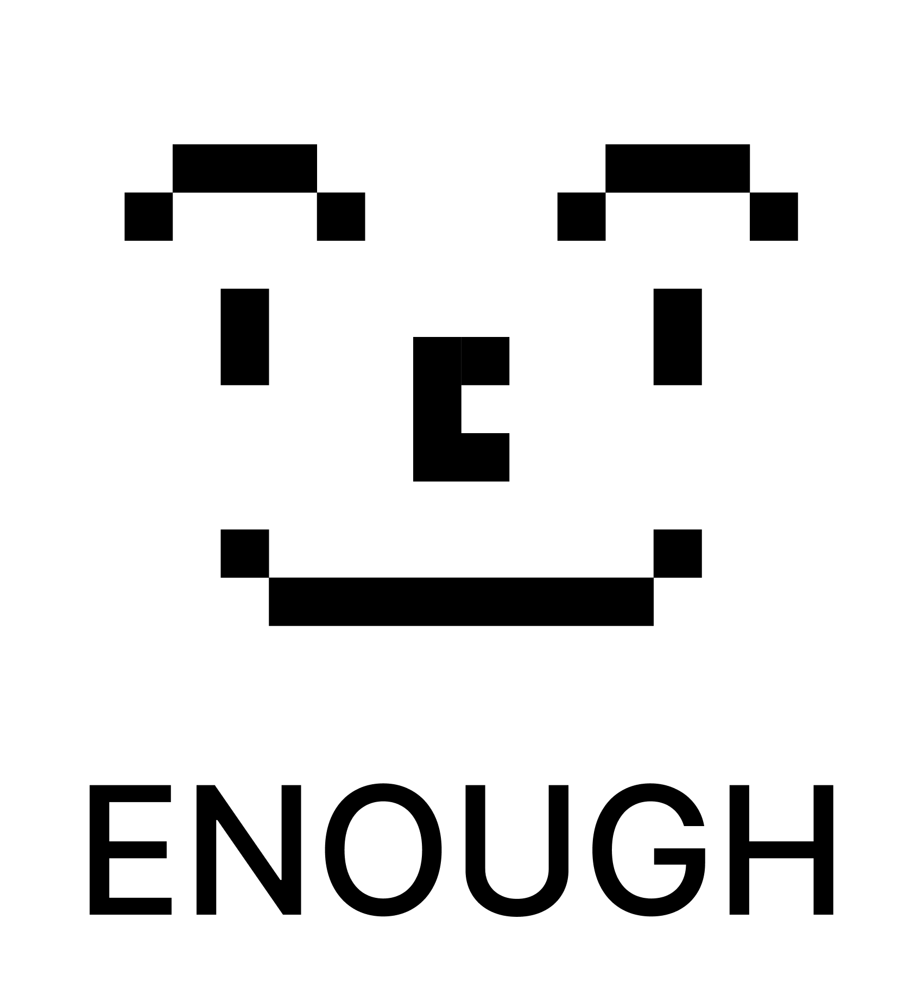

### ENOUGH

### ABOUT ENOUGH

다이어리와 캘린더 기능이 합쳐진 ENOUGH

🤨 왜 굳이 기능을 합친 건가요?

일상 기록과 일정 관리의 중요성을 인지하는 이들을 위해 제작된 앱이기 때문이죠!

|  | 다이어리 | 캘린더 |
| --- | --- | --- |
| 사용 빈도 | 낮음 | **높음** |
| UI 평가 | **긍정적** | 부정적 |

할 일이 산더미처럼 쌓인 현대인에게 캘린더는 필수적인 요소와 다를 바 없어 자주 사용하는 반면

꽤나 많은 시간이 소요되는 일상 기록은 미루게 되는 경향이 있습니다

또 다이어리는 예쁘고 귀엽게 디자인된 반면

캘린더는 디자인보다는 기능에만 충실한 경우가 많죠

결국 우리는 **효율적이고 편리하여 자주 사용하게 되고 디자인이 만족스러운 앱**을 원합니다

ENOUGH는 이를 목표로 하여 제작된 앱입니다

### Figma

https://www.figma.com/design/4WHyVdzEtiaRpCsR3cP1f6/NEW-ENOUGH?node-id=112-100

### STATUS

🤸🏻‍♀️ today screen 구현 중

🏃🏻‍♀️ 캘린더별 표시 유무 checkbox로 변경할 것

🏃🏻‍♀️ popup menu button 수정할 것

🏃🏻‍♀️ 삼성 캘린더의 date picker처럼 변경하되 문자 없이 숫자로 나타낼 것

🏃🏻‍♀️ 곡 정보의 길이가 overflow되는 경우 animation controller 혹은 marquee 패키지 활용할 것

🏃🏻‍♀️ splash screen 후 지문 및 비밀번호 잠금 화면 여부 고민 중

🏃🏻‍♀️ platform과 light 및 dark mode 고려할 것

### NOTE

ENOUGH는 가칭입니다
